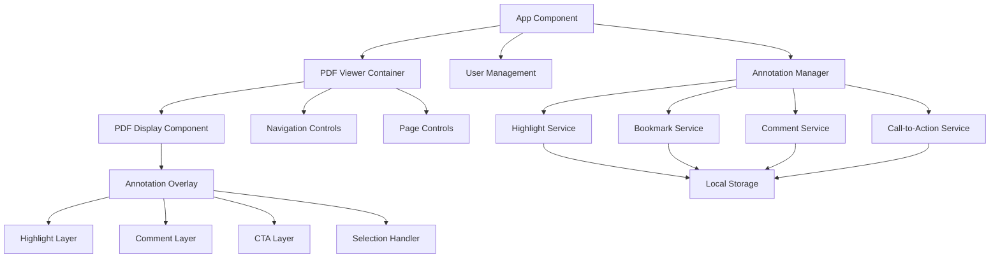

# Design Document

## Overview

The ebook utility will be built as a React application that provides PDF viewing capabilities with user-specific annotation features. The application will use react-pdf for PDF rendering, implement a layered annotation system for highlights, comments, and call-to-actions, and provide persistent storage for user data. The architecture will support multiple users with isolated annotation data and real-time interaction with PDF content.

## Architecture

The application follows a component-based React architecture with clear separation of concerns:



### Core Libraries and Dependencies

- **react-pdf**: Primary PDF rendering library for React
- **pdf-lib**: PDF manipulation and text extraction
- **React Context API**: State management for user sessions and annotations
- **Local Storage**: Persistent storage for user annotations
- **CSS-in-JS or Styled Components**: Dynamic styling for annotations

## Components and Interfaces

### 1. PDF Viewer Container (`PDFViewerContainer`)

**Purpose**: Main container component that orchestrates PDF display and annotation functionality.

**Props**:
```typescript
interface PDFViewerContainerProps {
  userId: string;
  onFileUpload: (file: File) => void;
}
```

**State**:
- Current PDF file
- Current page number
- Zoom level
- Loading states

### 2. PDF Display Component (`PDFDisplay`)

**Purpose**: Renders the PDF content using react-pdf library.

**Props**:
```typescript
interface PDFDisplayProps {
  file: File | null;
  pageNumber: number;
  onLoadSuccess: (pdf: any) => void;
  onTextSelection: (selection: TextSelection) => void;
}
```

**Key Features**:
- PDF page rendering
- Text selection detection
- Coordinate mapping for annotations

### 3. Annotation Overlay (`AnnotationOverlay`)

**Purpose**: Transparent layer over PDF content that handles annotation rendering and interaction.

**Props**:
```typescript
interface AnnotationOverlayProps {
  pageNumber: number;
  highlights: Highlight[];
  comments: Comment[];
  callToActions: CallToAction[];
  onAnnotationClick: (annotation: Annotation) => void;
  onAreaClick: (coordinates: { x: number; y: number }) => void;
}
```

### 4. Annotation Manager (`AnnotationManager`)

**Purpose**: Central service for managing all annotation operations.

**Interface**:
```typescript
interface AnnotationManager {
  createHighlight(selection: TextSelection, userId: string, documentId: string): Highlight;
  createBookmark(page: number, title: string, userId: string, documentId: string): Bookmark;
  createComment(coordinates: AreaCoordinates, content: string, userId: string, documentId: string): Comment;
  createCallToAction(selection: AreaSelection, url: string, label: string, userId: string, documentId: string): CallToAction;
  getAnnotations(userId: string, documentId: string): UserAnnotations;
  updateAnnotation(annotationId: string, updates: Partial<Annotation>): void;
  deleteAnnotation(annotationId: string): void;
}
```

### 5. Navigation Controls (`NavigationControls`)

**Purpose**: Provides page navigation and document controls.

**Props**:
```typescript
interface NavigationControlsProps {
  currentPage: number;
  totalPages: number;
  onPageChange: (page: number) => void;
  onZoomChange: (zoom: number) => void;
}
```

### 6. Bookmark Panel (`BookmarkPanel`)

**Purpose**: Displays and manages user bookmarks.

**Props**:
```typescript
interface BookmarkPanelProps {
  bookmarks: Bookmark[];
  onBookmarkClick: (bookmark: Bookmark) => void;
  onBookmarkEdit: (bookmark: Bookmark) => void;
  onBookmarkDelete: (bookmarkId: string) => void;
}
```

### 7. Comment Popup (`CommentPopup`)

**Purpose**: Displays and manages individual comments with edit/delete functionality.

**Props**:
```typescript
interface CommentPopupProps {
  comment: Comment;
  isVisible: boolean;
  onEdit: (commentId: string, newContent: string) => void;
  onDelete: (commentId: string) => void;
  onClose: () => void;
}
```

## Data Models

### User Model
```typescript
interface User {
  id: string;
  name: string;
  email?: string;
}
```

### Document Model
```typescript
interface Document {
  id: string;
  filename: string;
  uploadDate: Date;
  totalPages: number;
  fileHash: string; // For identifying same documents
}
```

### Highlight Model
```typescript
interface Highlight {
  id: string;
  userId: string;
  documentId: string;
  pageNumber: number;
  startOffset: number;
  endOffset: number;
  selectedText: string;
  color: string;
  coordinates: {
    x: number;
    y: number;
    width: number;
    height: number;
  };
  createdAt: Date;
  updatedAt: Date;
}
```

### Bookmark Model
```typescript
interface Bookmark {
  id: string;
  userId: string;
  documentId: string;
  pageNumber: number;
  title: string;
  description?: string;
  createdAt: Date;
  updatedAt: Date;
}
```

### Comment Model
```typescript
interface Comment {
  id: string;
  userId: string;
  documentId: string;
  pageNumber: number;
  content: string;
  coordinates: {
    x: number;
    y: number;
  };
  createdAt: Date;
  updatedAt: Date;
}
```

### Call-to-Action Model
```typescript
interface CallToAction {
  id: string;
  userId: string;
  documentId: string;
  pageNumber: number;
  url: string;
  label: string;
  coordinates: {
    x: number;
    y: number;
    width: number;
    height: number;
  };
  createdAt: Date;
  updatedAt: Date;
}
```

### Text Selection Model
```typescript
interface TextSelection {
  text: string;
  pageNumber: number;
  startOffset: number;
  endOffset: number;
  coordinates: {
    x: number;
    y: number;
    width: number;
    height: number;
  };
}
```

## Error Handling

### File Upload Errors
- **Invalid file type**: Display user-friendly message with supported formats
- **File size limits**: Implement size validation with clear error messaging
- **Corrupted PDF**: Handle PDF parsing errors gracefully

### PDF Rendering Errors
- **Loading failures**: Show retry options and fallback content
- **Page rendering issues**: Skip problematic pages with user notification
- **Memory constraints**: Implement page virtualization for large documents

### Annotation Errors
- **Storage failures**: Implement retry logic and user notification
- **Coordinate mapping issues**: Validate annotation positions before saving
- **Concurrent modifications**: Handle race conditions in annotation updates

### Network and External Link Errors
- **Call-to-action link failures**: Validate URLs and handle broken links
- **External resource loading**: Implement timeout and error handling

## Testing Strategy

### Unit Testing
- **Component testing**: Test each React component in isolation
- **Service testing**: Test annotation management logic
- **Utility testing**: Test coordinate mapping and text selection utilities
- **Data model validation**: Test all data model interfaces and validation

### Integration Testing
- **PDF rendering integration**: Test react-pdf integration and page rendering
- **Annotation workflow**: Test complete annotation creation and management flows
- **Storage integration**: Test local storage operations and data persistence
- **User session management**: Test user-specific data isolation

### End-to-End Testing
- **Complete user workflows**: Test full PDF upload, annotation, and navigation flows
- **Cross-browser compatibility**: Test on major browsers
- **Responsive design**: Test on different screen sizes
- **Performance testing**: Test with large PDF files and many annotations

### Accessibility Testing
- **Keyboard navigation**: Ensure all features are keyboard accessible
- **Screen reader compatibility**: Test with assistive technologies
- **Color contrast**: Ensure annotation colors meet accessibility standards
- **Focus management**: Test focus handling in modal dialogs and overlays

## Performance Considerations

### PDF Rendering Optimization
- **Page virtualization**: Only render visible pages for large documents
- **Lazy loading**: Load pages on demand as user navigates
- **Caching strategy**: Cache rendered pages in memory with size limits
- **Worker threads**: Use web workers for PDF processing when possible

### Annotation Performance
- **Efficient coordinate mapping**: Optimize text selection and positioning algorithms
- **Batch operations**: Group annotation updates to reduce storage operations
- **Memory management**: Clean up annotation overlays for non-visible pages
- **Debounced interactions**: Prevent excessive annotation updates during user interaction

### Storage Optimization
- **Data compression**: Compress annotation data before storage
- **Incremental updates**: Only store changes rather than full annotation sets
- **Storage limits**: Implement storage quota management and cleanup
- **Indexing**: Efficient retrieval of annotations by document and user